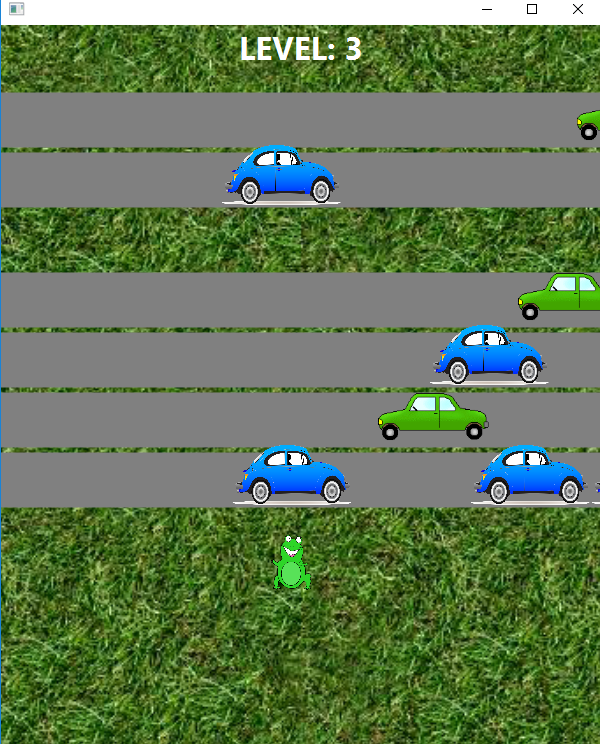
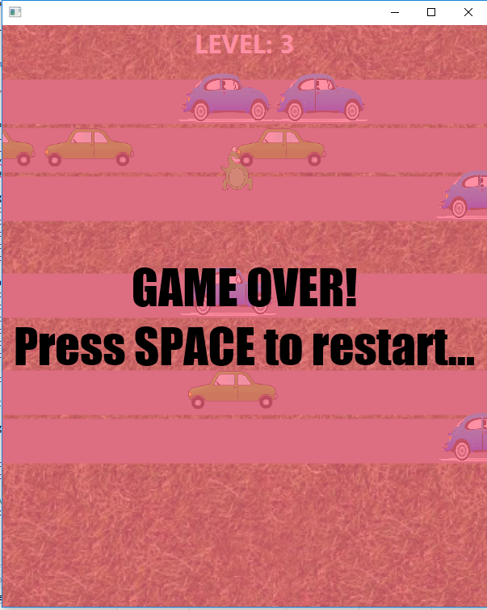

# JavaFX-Frogger
Created Frogger using JavaFX

## How to Play: 
The player controls the frog at the center bottom of the screen. The player is then responsible for making it to the other side of the screen without getting hit by cars. Each time the player makes it to the other side of the screen, the level increases, thereby spawning more cars.

To play...
1) Download Eclipse IDE (https://www.eclipse.org/ide/).
2) Clone my GameEngine repository along with this repository.
3) Open these two repositories up in Eclipse.
4) Run the FroggerApp.java file.

### Controls: 
**W** - Moves the frog one unit up

**A** - Moves the frog one unit left

**S** - Moves the frog one unit down

**D** - Moves the frog one unit right

**SPACE BAR** - Restarts the game upon game over

## Screenshots:

